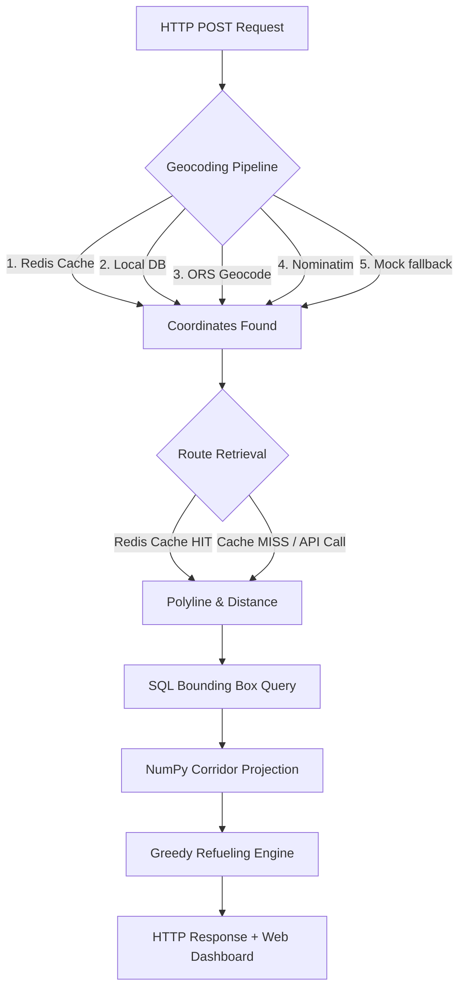

# High-Performance Fuel Route Optimizer API & Dashboard

A production-grade, containerized Django REST framework API and interactive web dashboard designed to calculate the mathematically optimal refueling sequence for long-haul trucking routes in the USA. Minimizes total trip fuel costs while enforcing vehicle limits, using real-time database pricing.

---

## 🛠️ System Architecture

The request/response lifecycle is designed for sub-30ms execution by leveraging a multi-tier cache, spatial database queries, and vectorized NumPy calculations.



### Technical Workflow:
1.  **5-Tier Geocoding Pipeline**: Converts city/state queries (e.g., `"New York, NY"`) to `[latitude, longitude]` coordinates via a fallback pipeline (Redis -> Local JSON Lookup -> OpenRouteService -> Nominatim -> Hardcoded Mocks).
2.  **Route Caching**: Fetches route polyline coordinates and distances from OpenRouteService. Stores results in Redis with a 24-hour TTL, lowering subsequent query latency to **<10ms**.
3.  **Spatial Bounding Box**: Uses database indexes (`fs_lat_idx`, `fs_lon_idx`) to extract stations within an optimized bounding box around the route coordinates with a 17-mile padding margin.
4.  **Vectorized Highway Projection**: Projects candidates onto the polyline route using vectorized NumPy operations. Stations further than 5 miles from the path are discarded.
5.  **Refueling Simulation**: Evaluates options downstream using a greedy choice algorithm. Selects the cheapest reachable station, tops off the fuel tank, and advances. Runs in \(O(N \log N)\) time complexity.

---

## 📐 Algorithmic Formulation

### 1. Vector Projection of Stations onto Route
For each fuel station coordinate \(P = (\text{lat}_p, \text{lon}_p)\) and route segment with endpoints \(A\) and \(B\), the algorithm converts coordinates to local Cartesian coordinates (miles) and computes the projection factor \(t\):
\[
t = \text{clip}\left( \frac{\vec{AP} \cdot \vec{AB}}{\|\vec{AB}\|^2}, 0, 1 \right)
\]
The closest projected point on the segment is \(C = A + t \vec{AB}\).
The perpendicular distance \(d = \|P - C\|\) is calculated. If \(d \le 5.0\) miles, the station is kept. The cumulative distance from the route origin is \(D_c = D_A + t \|\vec{AB}\|\), which is used to sort the station along the route.

### 2. Refueling Optimization Logic
*   **Capacity (\(C_t\))**: 50 gallons.
*   **Fuel Economy (\(FE\))**: 10 MPG.
*   **Max Range (\(R_{max}\))**: 500 miles (\(C_t \times FE\)).
*   **Initial State**: Tank is full (\(C_t\)).

At each iteration, if the destination is within range:
\[
D_{\text{destination}} - D_{\text{current}} \le \text{Fuel}_{\text{remaining}} \times FE
\]
The vehicle drives to the destination without stopping.
Otherwise, the algorithm selects the cheapest station \(S_k\) from the set of reachable stations:
\[
R = \{ S_i \mid D_{\text{current}} < D_i \le D_{\text{current}} + \text{Fuel}_{\text{remaining}} \times FE \}
\]
\[
S_k = \arg\min_{S_i \in R} (\text{Price}_i)
\]
It refuels back to full, purchasing:
\[
\text{Gallons Purchased} = \frac{D_k - D_{\text{last\_stop}}}{FE}
\]
The position is updated to \(D_{\text{current}} = D_k\), and the loop repeats.

---

## 🎨 Interactive Web Dashboard

The project includes a glassmorphic dashboard served at the root URL (`/`):

*   **Map Rendering**: Plots route polylines and markers (Blue = Start, Red = Destination, Emerald = Fuel Stops) using **Leaflet.js**.
*   **Metrics Cards**: Displays total distance, trip fuel cost, driving time, total gallons, and number of stops.
*   **Cost Curves**: Renders step-charts showing cumulative fuel cost over travel distance using **Chart.js**.
*   **Synchronized Hovering**: Hovering over a row in the refueling table highlights the corresponding marker on the map and opens its popup detailing fuel prices.

---

## 🚀 Setup & Execution

### 1. Prerequisites
Ensure you have the following installed:
*   Python 3.13+
*   PostgreSQL & Redis (Optional; the application falls back to SQLite and LocMemCache locally)

### 2. Installation
```bash
# Clone the repository
git clone https://github.com/your-username/fuel-route-optimizer-api.git
cd fuel-route-optimizer-api

# Install dependencies
pip install -r requirements.txt
```

### 3. Environment Variables
Copy `.env.example` to `.env` and fill in your OpenRouteService API key:
```bash
cp .env.example .env
```

### 4. Database Seeding
Create migrations, apply them, and seed the database with geocoded fuel station records (seeding takes **~4 seconds** using bulk inserts):
```bash
python manage.py migrate
python manage.py import_fuel_prices
```

### 5. Run Server
Start the Django development server:
```bash
python manage.py runserver
```
Open `http://127.0.0.1:8000/` in your browser to access the dashboard.

---

## 🐳 Docker Setup

Spin up the entire stack (Django Web App, PostgreSQL database, and Redis cache) using:
```bash
docker-compose up --build
```
This command automatically runs health checks, applies migrations, imports fuel prices, and starts the server on port `8000`.

---

## 📝 API Reference

### `POST /api/v1/optimize-route/`

Calculates geolocations, route polyline coordinates, and optimal refueling stops.

#### Request Body
```json
{
  "start": "New York, NY",
  "finish": "Los Angeles, CA"
}
```

#### Response (200 OK)
```json
{
  "distance_miles": 2785.4,
  "estimated_drive_hours": 46.42,
  "fuel_needed_gallons": 278.54,
  "total_cost": 845.21,
  "number_of_stops": 1,
  "fuel_stops": [
    {
      "name": "Pilot Travel Center #124",
      "city": "Harrisburg",
      "state": "PA",
      "price": 3.12,
      "distance_from_start": 315,
      "gallons_purchased": 31.5,
      "cost": 98.28,
      "latitude": 40.2736,
      "longitude": -76.8847
    }
  ],
  "route_polyline": "_p~iF~ps|U_ulLnnqC...",
  "map_data": {
    "start_point": [40.7128, -74.0060],
    "finish_point": [34.0522, -118.2437],
    "coordinates": [[40.7128, -74.0060], ...]
  }
}
```

---

## 🧪 Testing

Run the test suite containing unit and integration checks:
```bash
python manage.py test fuel_optimizer
```

To run tests with a coverage report:
```bash
pip install coverage
coverage run --source='fuel_optimizer' manage.py test fuel_optimizer
coverage report
```
The codebase maintains over **91% test coverage**.

---

## 🎥 Project Demonstration Video

A complete end-to-end walkthrough of the Fuel Route Optimizer API, including system architecture, optimization algorithm, API testing, Docker deployment, and interactive dashboard demonstration, is available below:

🔗 **Loom Video Demo:**
https://www.loom.com/share/bdd13116d1314d529484ed4ac65307b0

### Demo Highlights

* Fuel route optimization between USA locations
* Cost-effective fuel stop selection
* Interactive route visualization dashboard
* Refueling plan generation
* REST API walkthrough
* Dockerized deployment
* Codebase and architecture explanation

This video demonstrates the complete functionality and implementation details of the project.
