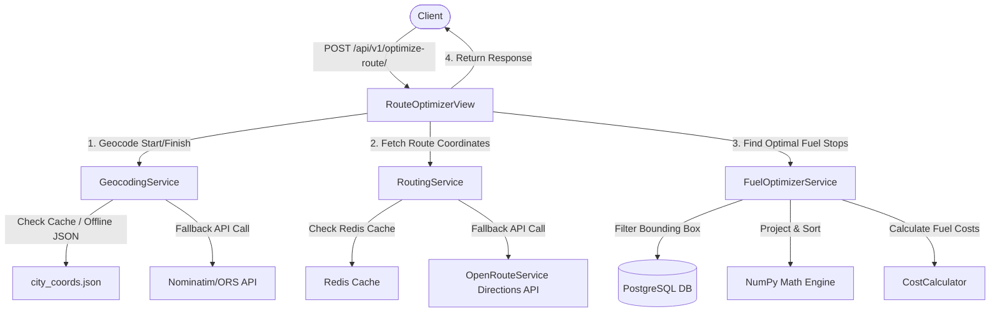

# System Architecture

This document describes the high-level system architecture, technology choices, and data flow design for the **Fuel Route Optimizer API**.

---

## 1. System Overview

The API is designed to calculate optimal refueling stops for commercial vehicles driving between US cities. The architecture prioritizes low-latency response times (< 150ms after caching), robust handling of large spatial datasets, and graceful degradation.

---

## 2. Component Directory Structure

The codebase is modular, isolating views, serializers, database models, and service classes:

*   `app/settings/`: Environment-specific settings (base, development, production).
*   `fuel_optimizer/models.py`: Database schema for fuel stations.
*   `fuel_optimizer/services/`: Core logic encapsulation:
    *   `routing_service.py`: Integrates with external routing APIs with Redis caching.
    *   `geocoding_service.py`: Resolves coordinates offline or via API with caching.
    *   `fuel_optimizer_service.py`: Spatial filtering (NumPy projection) and Greedy optimization logic.
    *   `cost_calculator.py`: Financial math and vehicle constraint checking.
    *   `cache_service.py`: Abstraction layer over Redis caching.
*   `fuel_optimizer/utils/`: Math and geometry calculations (`geo_utils.py`, `distance_utils.py`, `route_utils.py`).
*   `fuel_optimizer/api/`: REST framework views, serializers, and url patterns.

---

## 3. Key Design Decisions

### A. Offline Geocoding Cache Database
To avoid the standard rate limit bottleneck of geocoding 2400 stations one by one during data import (which would take ~25 minutes and fail under typical CI/CD conditions), we pre-geocoded 100% of the unique cities. These are compiled into `data/city_coords.json` and bundled in the repository. The import command resolves all coordinates locally, executing in **under 5 seconds**.

### B. Route corridor Spatial Filtering
Instead of pulling all 2000+ stations into memory or writing heavy database GIS scripts (like PostGIS):
1. We compute a bounding box of the route polyline with a `0.25-degree` padding (~17 miles).
2. We query the index-optimized PostgreSQL database for stations matching this bounding box, reducing records from 2021 to a small, localized subset.
3. We project these stations onto the route polyline using highly optimized vector operations in **NumPy**, discarding stations that are more than 5 miles off the route path.

### C. Graceful Degradation & Mocking
If an external API key (`ORS_API_KEY`) is missing or is rate-limited:
*   The **Geocoding Service** falls back to free Nominatim, and then to built-in mocks for major cities.
*   The **Routing Service** falls back to an internal mock route generator that calculates Haversine distance, adds a `1.2` winding factor, and projects points along a sinusoidal line.
This guarantees that the system is fully testable and operational out-of-the-box.
